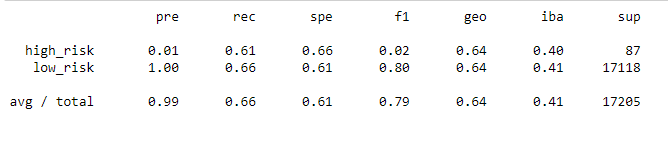

# Credit_Risk_Analysis

## Analysis Overview
The purpose of this analysis was to use Python to build, and evaluate the effectiveness of, several machine learning models to predict credit risk.

To complete this analysis, I used a total of six machine learning models in the following ways:
1. Oversampled the data with Naive Random Oversample using RandomOverSampler 
2. Oversampled the data with SMOTE oversampling.
3. Undersampled the data using the ClusterCentroids algorithm.
4. Used a combined approach for oversampling and undersampling with the SMOTEENN algorithm.
5. Attempt to reduce bias with BalancedRandomForestClassifier
6. Attempt to reduce bias with EasyEnsembleClassifier

## Results
In this results section, I will share the balanced accuracy scores, precision, and recall scores of all six machine learning models used in this analysis.

### RandomOverSampler Model
 </img> 
 </img> 
Balanced Accuracy Score: 64%
High Risk has a precision of only 1% with 61% recall and a low F1 score of 2%.
Low risk has a high precision of 100%, recall of 66%, and a high F1 score of 8%. This is due to the high number in the Low Risk population.

### SMOTE Model
 </img> 
 </img> 
Balanced Accuracy Score: 65%
High Risk has a precision of only 1% again, but at 66%, the recall is higher than with RandomOverSample. The F1 score is again 2%.
Low Risk has a 100% precision again, and a slightly lower recall of 64%. The F1 score is also slightly lower, at 78%.

### ClusterCentroids Model
 </img> 
 </img> 
The ClusterCentroids algorithm gives us significantly different results.
Balanced Accuracy Score: 51%
High Risk still has a precision of only 1%, and the recall has dropped to 59%. This change drops the F1 score to 1%.
Low Risk still has a precision of 100%, but recall has dropped to 44%. This results in an F1 score of 61%.

### SMOTEENN Model
 </img> 
 </img> 
Balanced Accuracy Score: 53%
High Risk precision of 1% again, with a recall of 66%, which is the same as with SMOTE Oversampling. The F1 score is again 2%.
Low Risk precision of 100% again, with a recall of 60%. The F1 score is 75%.

### BalancedRandomForestClassifier Model
 </img> 
 </img> 
With the BalancedRandomForestClassifier Model, we get our highest Balanced Accuracy Score yet.
Balanced Accuracy Score: 78%
High Risk has a slightly higher precision rate of 3% and a recall rate of 67%. This gives an F1 score of 6%.
Low Risk still has a 100% precision rate and a high recall of 90%, giving it a very high F1 score of 94%.

### EasyEnsembleClassifier Model
 </img> 
 </img> 
The EasyEnsembleClassifier continues to rase our Balanced Accuracy Score.
Balanced Accuracy Score: 90%
High Risk has a higher precision of 8%, and a high recall of 85%, leading to the highest F1 score we have seen for High Risk population, 14%. It should be noted that this F1 score is still low.
Low Risk has a precision of 100% once again, and its highest recall at 95%. This gives a very high F1 score of 97%. The recall being at 95% is a result of less false positives.

## Summary
Ultimately, each model showed low precision when determining High Risk. The ensemble models, especially the EasyEnsembleClassifier yielded the highest Balanced Accuracy Score, Precision, Recall, and F1 scores. Even though this model was the most successful, it still was weak when predicting High Risk.

Because the low precision predicting High Risk could damage a bank's earnings and overall financial health, I would not recommend any of these models to be used when predicting credit risk.